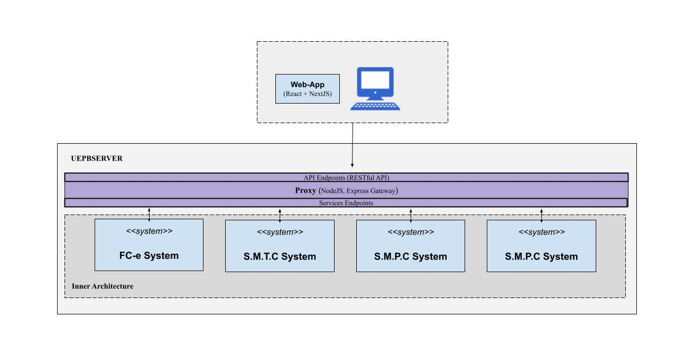

# Welcome !!

  
     

  Organization for the development of projects carried out in partnership between NUTES/UEPB and Sefaz/PB

  
  

 Partnership: <a href="http://nutes.uepb.edu.br/">NUTES-UEPB</a> | <a href="https://www.sefaz.pb.gov.br/">SEFAZ-PB</a>

